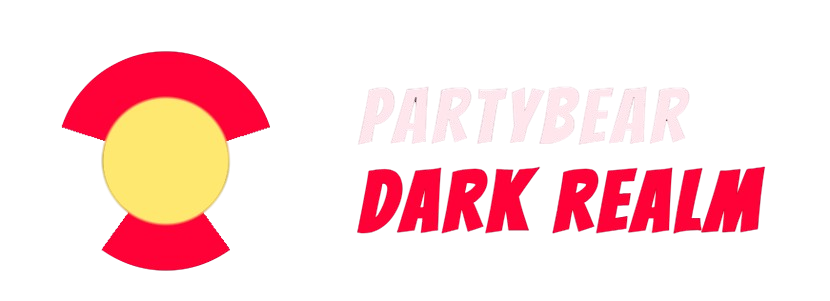

<a id="readme-top"></a>

<!-- PROJECT SHIELDS -->
[![Contributors][contributors-shield]][contributors-url]
[![Forks][forks-shield]][forks-url]
[![Stargazers][stars-shield]][stars-url]
[![Issues][issues-shield]][issues-url]
[![MIT License][license-shield]][license-url]

<br />
<div align="center">
  <h3 align="center">PartyBear's Dark Realm</h3>
  
  <p align="center">
    A comic-horror React experience that blends FNAF lore, crossover nightmares, and XP-powered arcade games.
    <br />
    <a href="#about-the-project"><strong>Explore the docs</strong></a>
  </p>
</div>


<!-- TABLE OF CONTENTS -->
<details>
  <summary>Table of Contents</summary>
  <ol>
    <li>
      <a href="#about-the-project">About The Project</a>
      <ul>
        <li><a href="#main-page-description">Main Page Description</a></li>
        <li><a href="#built-with">Built With</a></li>
        <li><a href="#third-party-components">Third-Party Components</a></li>
        <li><a href="#tutorials--references">Tutorials / References</a></li>
        <li><a href="#design-inspiration">Design Inspiration (Figma)</a></li>
        <li><a href="#ux--ui--clean-code-notes">UX / UI & Clean Code Notes</a></li>
      </ul>
    </li>
    <li>
      <a href="#getting-started">Getting Started</a>
      <ul>
        <li><a href="#prerequisites">Prerequisites</a></li>
        <li><a href="#installation">Installation</a></li>
      </ul>
    </li>
    <li><a href="#routes">Routes</a></li>
    <li><a href="#deployment-notes-github">Deployment Notes (GitHub)</a></li>
    <li><a href="#roadmap">Roadmap</a></li>
    <li><a href="#license">License</a></li>
    <li><a href="#contact">Contact</a></li>
    <li><a href="#acknowledgments">Acknowledgments</a></li>
  </ol>
</details>


<!-- ABOUT THE PROJECT -->
## About The Project

PartyBear's Dark Realm is a comic archive of night-shift horror with dedicated pages for every FNAF entry listed in the brief plus crossover specials. The Home page works as the index, while the Arcade page includes interactive mini-games that award XP and achievements. The site combines bold panel layouts, scroll-driven transitions, and a Three.js scene.

<p align="right">(<a href="#readme-top">back to top</a>)</p>


## Main Page Description

The Home page (routes `/` and `/home`) is the central index. It renders sections from JSON data arrays and displays game cards with images and summaries. Each card links to a dedicated comic page. Additional timeline, rituals, and manifesto sections provide narrative context while staying fully responsive.

<p align="right">(<a href="#readme-top">back to top</a>)</p>


### Built With

[](https://react.dev/)
[](https://reactrouter.com/)
[](https://vitejs.dev/)
[](https://threejs.org/)
[](https://firebase.google.com/)
[](https://developer.mozilla.org/en-US/docs/Web/CSS)

<p align="right">(<a href="#readme-top">back to top</a>)</p>


## Third-Party Components

* React Icons: https://react-icons.github.io/react-icons/
* Three.js: https://threejs.org/
* Firebase Web SDK: https://firebase.google.com/docs/web/setup
* React Router: https://reactrouter.com/

<p align="right">(<a href="#readme-top">back to top</a>)</p>


## Tutorials / References

* Best README Template: https://github.com/othneildrew/Best-README-Template
* Responsive image sizing: https://www.shopify.com/es/blog/imagenes-para-web-tamano#
* UX reference: https://woko.agency/blog/monitorizar-evaluar-experiencia-usuario/
* Clean code reference: https://www.hostgator.mx/blog/clean-code-codigo-limpio/

<p align="right">(<a href="#readme-top">back to top</a>)</p>


## Design Inspiration

* https://www.figma.com/templates/web-design-inspiration/
* https://www.figma.com/community/file/1131985803868452168
* https://moosend.com/blog/
* https://edudemos.eu/

<p align="right">(<a href="#readme-top">back to top</a>)</p>


## UX / UI & Clean Code Notes

* High-contrast comic typography and consistent navigation for clarity.
* Scroll reveals and section rhythm designed to reduce cognitive load.
* Responsive layouts with flexbox + media queries.
* Naming conventions: kebab-case for folders and className values, PascalCase for component and style filenames, camelCase for variables and .js files.
* Simple, readable functions with minimal comments and DRY patterns where possible.

<p align="right">(<a href="#readme-top">back to top</a>)</p>


<!-- GETTING STARTED -->
## Getting Started

### Prerequisites

* npm
  ```sh
  npm install npm@latest -g
  ```

### Installation

1. Install dependencies
   ```sh
   npm install
   ```
2. Run the dev server
   ```sh
   npm run dev
   ```
3. Open `http://localhost:5173` or `http://localhost:5173/home`

### Tutorial: Full Setup (Step-by-Step)

1. Clone the repository
   ```sh
   git clone http://github.com/partybearcode/partybear-dark-realm
   cd partybear-dark-realm
   ```
2. Install all dependencies
   ```sh
   npm install
   ```
3. Start the development server
   ```sh
   npm run dev
   ```
4. Open the app in the browser
   ```text
   http://localhost:5173
   ```

<p align="right">(<a href="#readme-top">back to top</a>)</p>


## Routes

* `/` -> redirects to `/home`
* `/home` -> Main comic index
* `/arcade` -> Interactive mini-games (XP + achievements)
* `/leaderboard` -> Global XP leaderboard
* `/games/:slug` -> Individual comic pages
* `/auth` -> Login / register
* `/profile` -> User profile and achievements
* `/privacy-policy` -> Privacy policy
* `/conditions-of-sale` -> Conditions of sale

<p align="right">(<a href="#readme-top">back to top</a>)</p>


## Deployment Notes (GitHub)

* Create `main` and `develop` branches.
* Push to GitHub and submit the repo URL (only the URL).
* Keep media lightweight (GitHub limit ~50MB per file).
* Replace placeholder images with optimized assets before final submission.

<p align="right">(<a href="#readme-top">back to top</a>)</p>


## Roadmap

- [x] Core comic archive and FNAF pages
- [x] Arcade games with XP and achievements
- [x] Replace placeholders with official artwork
- [x] Add additional arcade challenges

<p align="right">(<a href="#readme-top">back to top</a>)</p>


## License

Distributed under the MIT License.

<p align="right">(<a href="#readme-top">back to top</a>)</p>


## Contact

Project Author: Raul

<p align="right">(<a href="#readme-top">back to top</a>)</p>


## Acknowledgments

* https://github.com/othneildrew/Best-README-Template
* https://reactrouter.com/
* https://threejs.org/
* https://firebase.google.com/

<p align="right">(<a href="#readme-top">back to top</a>)</p>


<!-- MARKDOWN LINKS & IMAGES -->
[contributors-shield]: https://img.shields.io/github/contributors/partybearcode/partybear-dark-realm.svg?style=for-the-badge
[contributors-url]: https://github.com/partybearcode/partybear-dark-realm/graphs/contributors
[forks-shield]: https://img.shields.io/github/forks/partybearcode/partybear-dark-realm.svg?style=for-the-badge
[forks-url]: https://github.com/partybearcode/partybear-dark-realm/network/members
[stars-shield]: https://img.shields.io/github/stars/partybearcode/partybear-dark-realm.svg?style=for-the-badge
[stars-url]: https://github.com/partybearcode/partybear-dark-realm/stargazers
[issues-shield]: https://img.shields.io/github/issues/partybearcode/partybear-dark-realm.svg?style=for-the-badge
[issues-url]: https://github.com/partybearcode/partybear-dark-realm/issues
[license-shield]: https://img.shields.io/github/license/partybearcode/partybear-dark-realm.svg?style=for-the-badge
[license-url]: https://github.com/partybearcode/partybear-dark-realm/blob/main/LICENSE
